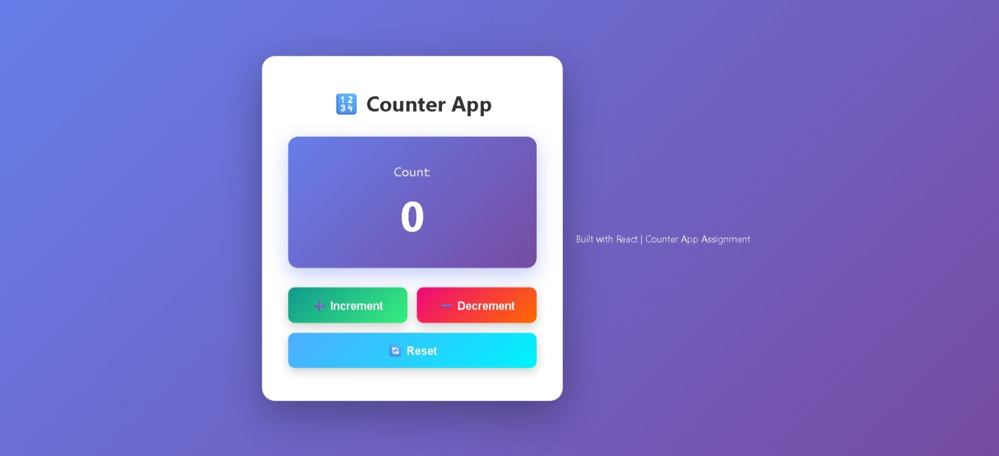

# 🔢 Counter App

React mini project built with React CDN + Babel (no npm setup required).

## 📌 Project Type

- Original assignment version: `counter-app.html`
- HTML website-style version for live demo: `counter-app.html`

## 🖼️ Screenshot

## 🚀 Live Demo

- Vercel: *(Add URL after deployment)*

## ✨ Features

- Increment, decrement, and reset controls
- Guard against negative values
- Visual highlight when count crosses threshold

## 🛠️ Run Locally

1. Open `counter-app.html` in your browser.
2. Interact with buttons to test all actions.

## 🌐 Deploy (Vercel)

1. Select `Counter/` as root directory.
2. Build command: *(none)*
3. Output directory: `.`
4. Deploy.

## 📁 Files

- `counter-app.html`
- `COUNTER.jpeg`
- `README.md`
