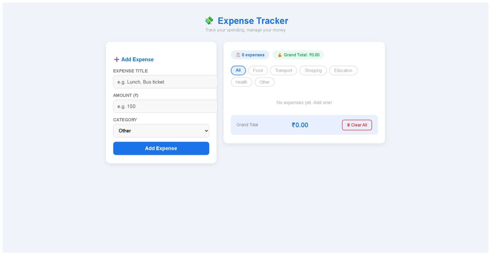

# 💸 Expense Tracker

React mini project for expense logging, filtering, and totals with local storage persistence.

## 📌 Project Type

- Original source assignment version: `ExpenseTracker.jsx`
- HTML website-style version for live demo: `index.html`

## 🖼️ Screenshot

## 🚀 Live Demo

- Vercel: *(Add URL after deployment)*

## ✨ Features

- Add expense with title, amount, and category
- Category filter with dynamic totals
- Expense deletion + clear all
- Persistent state with `localStorage`

## 🛠️ Run Locally

### HTML website-style live demo
1. Open `index.html` in your browser.

### React source version
1. Create/open a React app.
2. Replace `src/App.jsx` with `ExpenseTracker.jsx`.
3. Run `npm install` and `npm run dev` (or `npm start` for CRA).

## 🌐 Deploy (Vercel)

1. Select `Expense/` as root directory.
2. Build command: *(none)*
3. Output directory: `.`
4. Deploy (serves `index.html` as live demo UI).

## 📁 Files

- `ExpenseTracker.jsx`
- `index.html`
- `EXPENSE.jpeg`
- `README.md`
