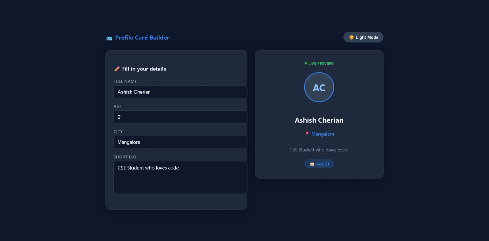

# 🎓 LetsUpgrade React Mini Projects Portfolio

### React fundamentals through interactive mini projects with deploy-ready HTML website-style demos.

## 📋 Project Overview

This repository contains 4 React mini-projects completed as part of LetsUpgrade assignments.

Each project contains:
- ✅ Original assignment/source implementation
- ✅ HTML website-style version for live demo deployment (`index.html`)
- ✅ Project-level README and screenshot (`.jpeg`)

Repository: https://github.com/AshishCherian15/react-mini-projects

## 🚀 Featured Projects

### 🔢 Project 1: Counter App

- Original assignment file: `Counter/counter-app.html`
- HTML website-style live demo file: `Counter/index.html`
- Screenshot: 
- Live Demo: *(Pending update / currently returning 404)*
- Details: [Counter/README.md](./Counter/README.md)

### 💸 Project 2: Expense Tracker

- Original source file: `Expense/ExpenseTracker.jsx`
- HTML website-style live demo file: `Expense/index.html`
- Screenshot: 
- Live Demo: [https://02-expense.vercel.app/](https://02-expense.vercel.app/)
- Details: [Expense/README.md](./Expense/README.md)

### 🪪 Project 3: Profile Card

- Original assignment file: `Profile-card/ProfileCard.html`
- HTML website-style live demo file: `Profile-card/index.html`
- Screenshot: 
- Live Demo: [https://03-profile-card.vercel.app/](https://03-profile-card.vercel.app/) *(currently returning 404)*
- Details: [Profile-card/README.md](./Profile-card/README.md)

### 📝 Project 4: Todo List

- Original source file: `TO DO/TodoApp.jsx`
- HTML website-style live demo file: `TO DO/index.html`
- Screenshot: 
- Live Demo: [https://04-to-do-eight.vercel.app/](https://04-to-do-eight.vercel.app/)
- Details: [TO DO/README.md](./TO%20DO/README.md)

## 🛠️ Local Development

### Run HTML website-style versions

- `Counter/index.html`
- `Expense/index.html`
- `Profile-card/index.html`
- `TO DO/index.html`

### Run source-component versions

1. Create/open a React app.
2. Replace `src/App.jsx` with either:
   - `Expense/ExpenseTracker.jsx`
   - `TO DO/TodoApp.jsx`
3. Run: `npm install` then `npm run dev` (or `npm start` for CRA).

## 📁 Folder Structure

```text
react-mini-projects/
│
├── Counter/
│   ├── counter-app.html
│   ├── index.html
│   ├── COUNTER.jpeg
│   └── README.md
│
├── Expense/
│   ├── ExpenseTracker.jsx
│   ├── index.html
│   ├── EXPENSE.jpeg
│   └── README.md
│
├── Profile-card/
│   ├── ProfileCard.html
│   ├── index.html
│   ├── PROFILECARD.jpeg
│   └── README.md
│
├── TO DO/
│   ├── TodoApp.jsx
│   ├── index.html
│   ├── TODO.jpeg
│   └── README.md
│
└── README.md
```

## 🏆 Bootcamp Context

Program: LetsUpgrade React Bootcamp Track  
Focus: React fundamentals through assignment-based mini projects  
Scope in this repository: Counter App, Expense Tracker, Profile Card, Todo List

## ✅ LetsUpgrade Certificate Verification

Certificate Holder: Ashish Cherian  
Organizer: LetsUpgrade EdTech Pvt. Ltd.  
Verification Link: [https://www.letsupgrade.in/verify](https://www.letsupgrade.in/verify)

### Verified Workshop Mapping

| Workshop / Assignment | Completion Date | Certificate No | Collaboration | Status |
|---|---|---|---|---|
| React Bootcamp (Counter App + Profile Card) | 11 December 2025 — 12 December 2025 (2 Days) | LUERJSDEC12530 | NSDC, ITM Edutech, GDG MAD | ✅ Completed |
| React Expense Tracker Essentials Mini Project | 29 January 2026 | LUEETJAN12635 | NSDC, ITM Edutech, GDG MAD | ✅ Completed |
| React To-Do List Essentials Mini Project | 10 January 2026 | LUETLADEC12548 | NSDC, ITM Edutech, GDG MAD | ✅ Completed |

Verification note: Workshop and certificate information is compiled from the repository's archived LetsUpgrade source notes (`LU.txt` history) and project assignment records.

## 🌐 Live Deployments

| Project | Live URL | Status |
|---|---|---|
| 🔢 Counter | Pending (update after redeploy) | ⚠️ 404 |
| 💸 Expense Tracker | https://02-expense.vercel.app/ | ✅ Live |
| 🪪 Profile Card | https://03-profile-card.vercel.app/ | ⚠️ 404 |
| 📝 Todo List | https://04-to-do-eight.vercel.app/ | ✅ Live |

## 🚀 Deployment Plan (Vercel)

1. Import the repo into Vercel.
2. Deploy each folder as separate project root.
3. Keep settings for static HTML demo:
   - Build command: *(none)*
   - Output directory: `.`
4. Redeploy `Counter/` and `Profile-card/` after this update (now includes `index.html`).

## ✉️ Connect & Feedback

- GitHub: [@AshishCherian15](https://github.com/AshishCherian15)
- Repository: [react-mini-projects](https://github.com/AshishCherian15/react-mini-projects)

Last Updated: March 2026 | Status: Documentation + Vercel Entry Fixes ✅
